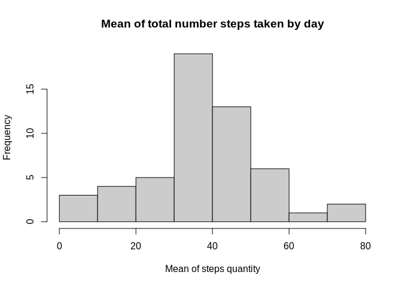
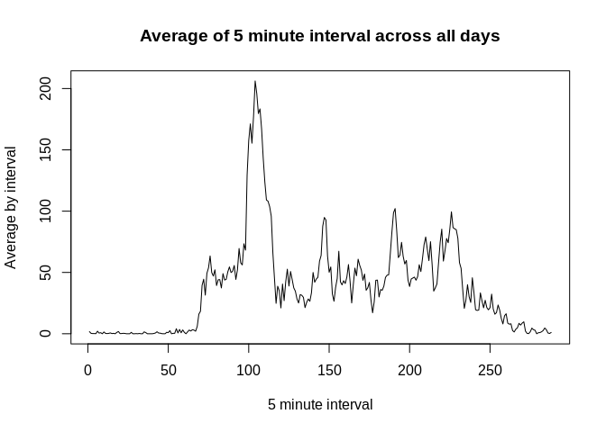
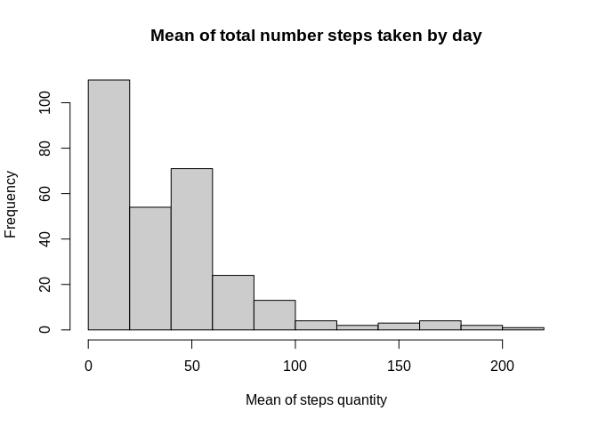
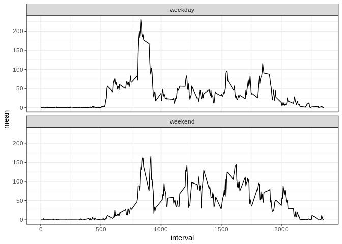

```r
library(dplyr)
```

```
## 
## Attaching package: 'dplyr'
```

```
## The following objects are masked from 'package:stats':
## 
##     filter, lag
```

```
## The following objects are masked from 'package:base':
## 
##     intersect, setdiff, setequal, union
```

```r
library(lubridate)
```

```
## 
## Attaching package: 'lubridate'
```

```
## The following object is masked from 'package:base':
## 
##     date
```

```r
library(ggplot2)
```


## Loading and preprocessing the data

The dataset includes 3 variables described below:
* **steps**: Number of steps taking in a 5-minute interval (missing values are coded as `NA`)
* **date**: The date on which the measurement was taken in YYYY-MM-DD format
* **interval**: Identifier for the 5-minute interval in which measurement was taken


```r
unzip("activity.zip")
data <- read.csv("activity.csv", header=T, sep=",", stringsAsFactors = F)
data <- transform(data, date = ymd(date))
head(data)
```

```
##   steps       date interval
## 1    NA 2012-10-01        0
## 2    NA 2012-10-01        5
## 3    NA 2012-10-01       10
## 4    NA 2012-10-01       15
## 5    NA 2012-10-01       20
## 6    NA 2012-10-01       25
```


## What is mean total number of steps taken per day?

In the following summary the mean and median of the steps taken by day was computed with the mean represented in the plot.


```r
steps_summary <- data %>% 
    filter(!is.na(steps)) %>% 
    group_by(date) %>% 
    summarize(
        mean = mean(steps, na.rm = TRUE), 
        median = median(steps, na.rm = TRUE))

hist(steps_summary$mean, 
     col="gray80", 
     main="Mean of total number steps taken by day",
     xlab="Mean of steps quantity")
```

<!-- -->

```r
steps_summary
```

```
## # A tibble: 53 x 3
##    date         mean median
##    <date>      <dbl>  <dbl>
##  1 2012-10-02  0.438      0
##  2 2012-10-03 39.4        0
##  3 2012-10-04 42.1        0
##  4 2012-10-05 46.2        0
##  5 2012-10-06 53.5        0
##  6 2012-10-07 38.2        0
##  7 2012-10-09 44.5        0
##  8 2012-10-10 34.4        0
##  9 2012-10-11 35.8        0
## 10 2012-10-12 60.4        0
## # ... with 43 more rows
```


## What is the average daily activity pattern?

```r
avgday <- data %>%
    group_by(interval) %>% 
    summarise(mean = mean(steps, na.rm=T))

plot(avgday$mean, type="l", 
     main="Average of 5 minute interval across all days",
     ylab = "Average by interval",
     xlab = "5 minute interval")
```

<!-- -->


## Imputing missing values
The dataset has **2304**  missing values in the variable `step`.

As strategy to fill the NA values we will use the average steps in the interval across all days. Note that when we remove the NA values in the first plot the distribuition became Normal distributed, when the NA values was substituted with the average of the interval the distribution became right skewed.

```r
# Create a new dataset that is equal to the original dataset but with the missing data filled in.
data_fill <- data %>% 
    group_by(interval) %>% 
    mutate(steps = ifelse(is.na(steps), mean(steps, na.rm = T), steps))

# Calculate and report the mean and median total number of steps taken per day
fill_summary <- data_fill %>% 
    summarize(
        mean = mean(steps), 
        median = median(steps))

# histogram with the new data
hist(fill_summary$mean, 
     col="gray80", 
     main="Mean of total number steps taken by day",
     xlab="Mean of steps quantity")
```

<!-- -->

```r
fill_summary
```

```
## # A tibble: 288 x 3
##    interval   mean median
##       <int>  <dbl>  <dbl>
##  1        0 1.72        0
##  2        5 0.340       0
##  3       10 0.132       0
##  4       15 0.151       0
##  5       20 0.0755      0
##  6       25 2.09        0
##  7       30 0.528       0
##  8       35 0.868       0
##  9       40 0           0
## 10       45 1.47        0
## # ... with 278 more rows
```


## Are there differences in activity patterns between weekdays and weekends?

In the plots below we could see that in the week days there is a greate number of steps between interval 800 and 950 while in the weekend the steps are equilibrated during the day.

```r
days <- data_fill %>% 
    mutate(day = as.factor(ifelse(wday(date) %in% c(1, 7), "weekend", "weekday"))) %>% 
    group_by(day, interval) %>% 
    summarize(mean = mean(steps))

weekday <- filter(days, day == "weekday")
weekend <- filter(days, day == "weekend")

ggplot(days, aes(interval, mean)) +
    geom_line() +
    theme_bw() +
    facet_wrap(~day, nrow = 2)
```

<!-- -->


